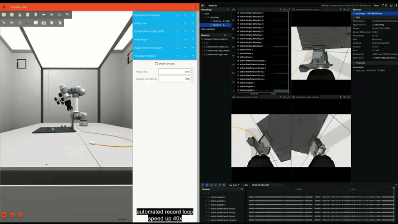
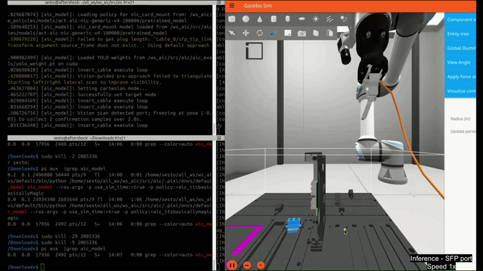
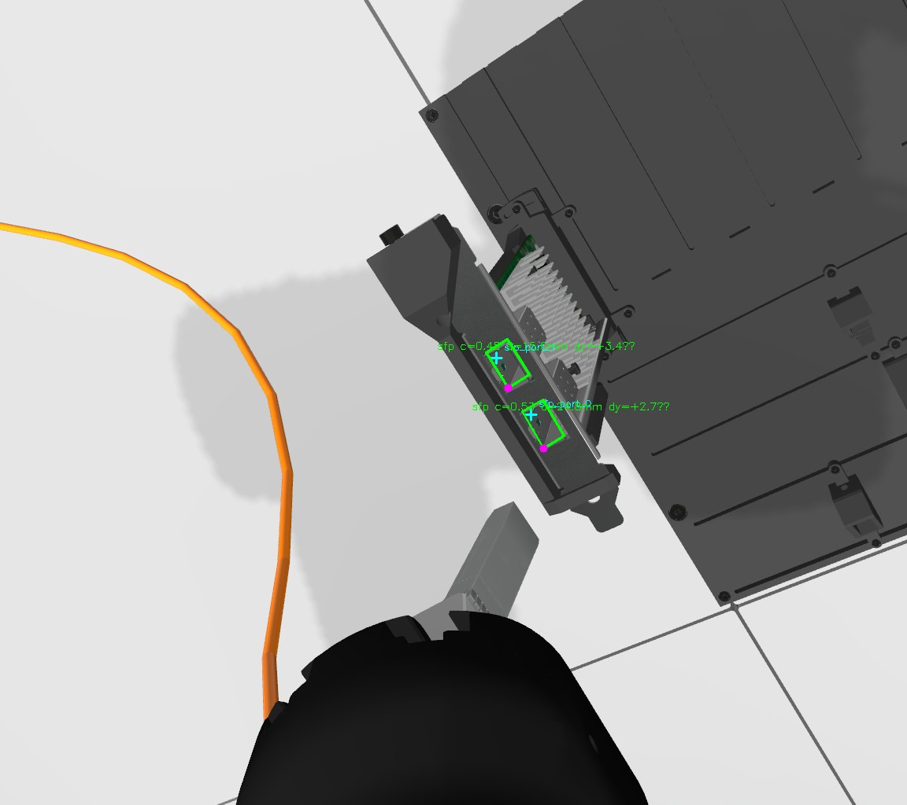
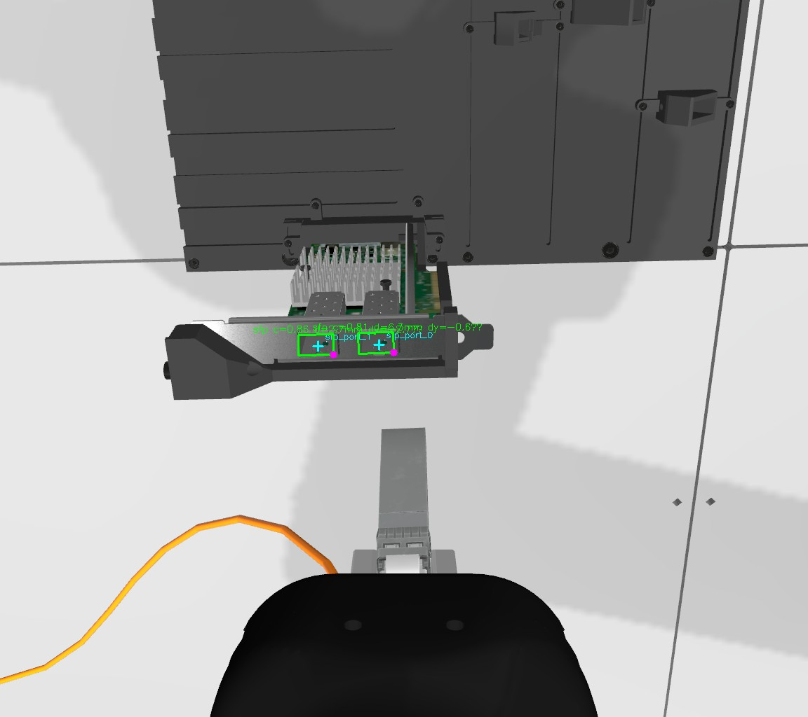
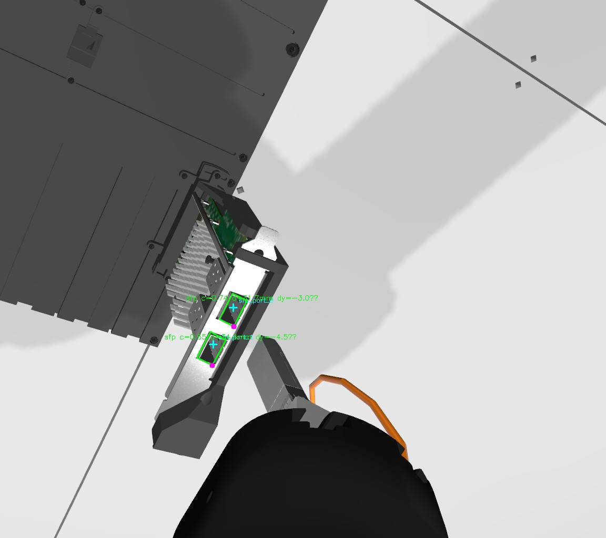
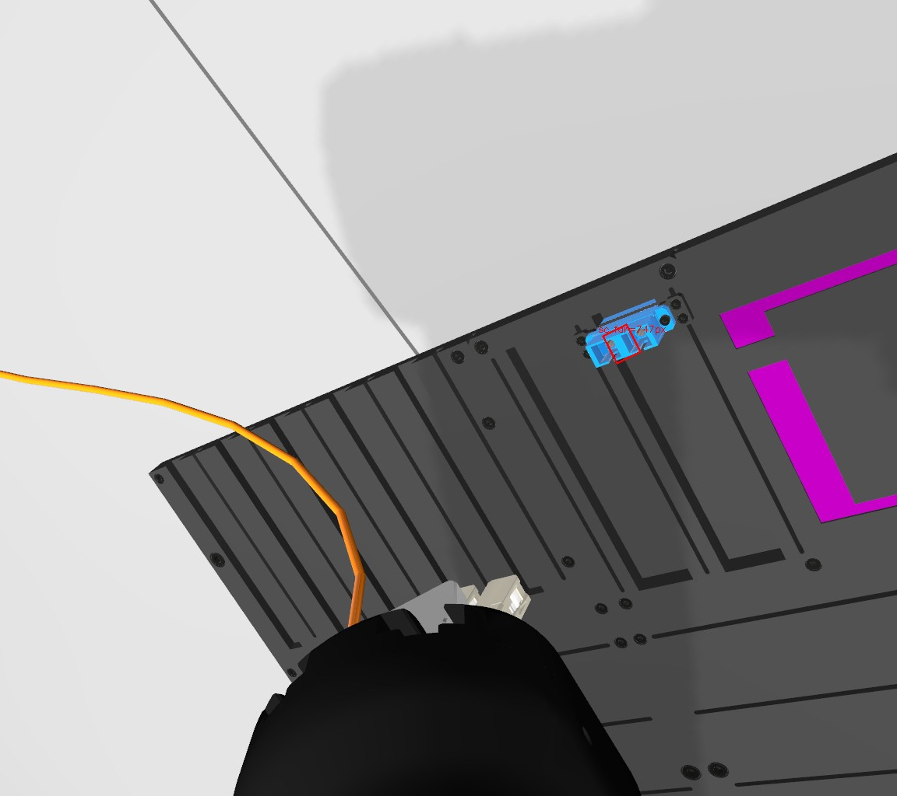
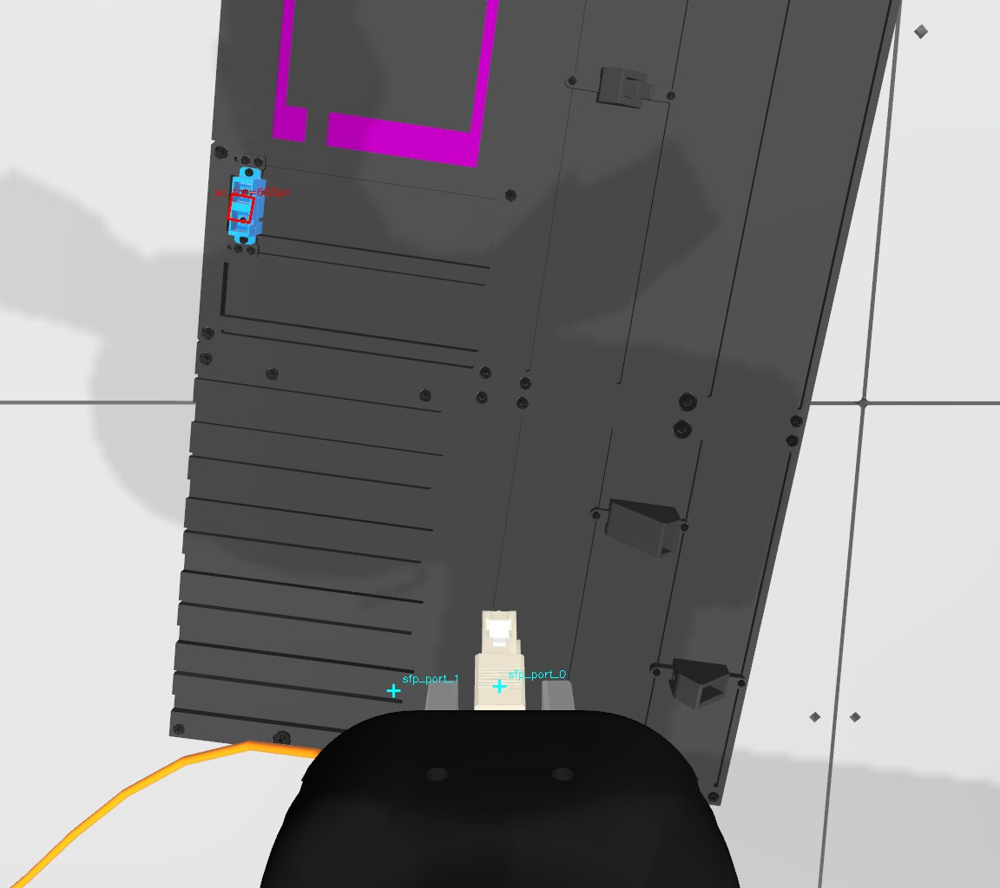
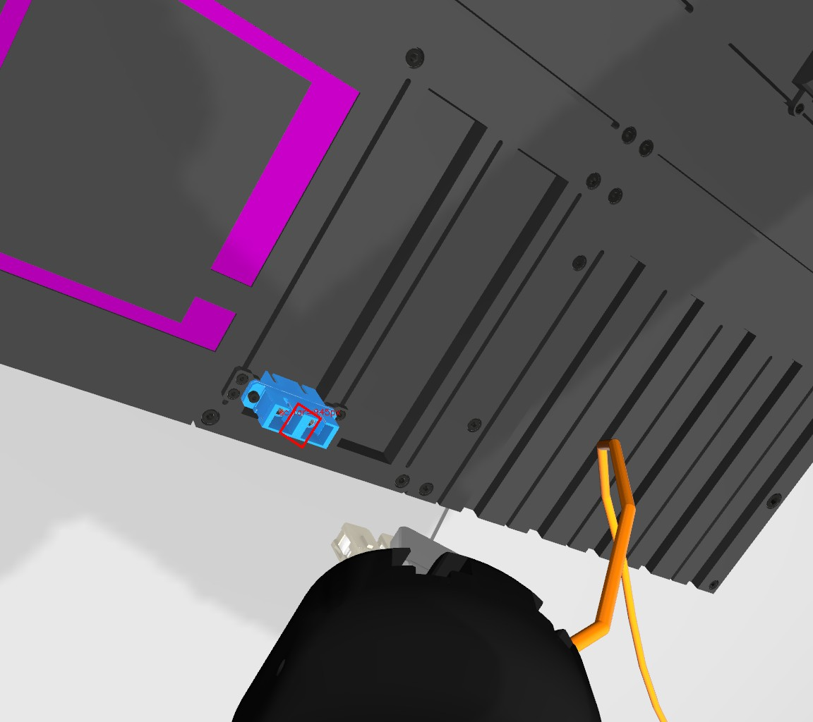
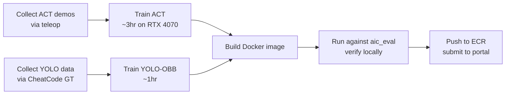

# MultiView ACT UR5 Servoing

<p align="center">
  
  &nbsp;
  
</p>
<p align="center">
  <em><b>Left:</b> Data collection — Intrinsic's <code>CheatCode</code> policy drives the robot through varied NIC poses to generate ground-truth-supervised training data for our ACT model and YOLO-OBB detector. &nbsp; <b>Right:</b> Deployment — our <code>MultiViewACTPolicy</code> autonomously inserts the cable into SFP and SC ports using multi-view perception + closed-loop visual servoing.</em>
</p>

> A hybrid robotic manipulation pipeline combining **Action Chunking with Transformers (ACT)**, **multi-view scene perception**, and **closed-loop visual servoing** for autonomous fiber-optic cable insertion on a UR5e arm.
>
> Built for the [AI for Industry Challenge 2026](https://github.com/intrinsic-dev/aic), an open robotics competition organized by [Intrinsic](https://www.intrinsic.ai/).

---

## Table of Contents

1. [The Challenge](#1-the-challenge)
2. [The Research Gap](#2-the-research-gap)
3. [Pipeline Overview](#3-pipeline-overview)
4. [Tier 1 — ACT Policy](#4-tier-1--act-policy)
5. [Tier 2 — Multi-View Scene Registration](#5-tier-2--multi-view-scene-registration)
6. [Tier 3 — Cable-Aware Approach + Visual Servoing](#6-tier-3--cable-aware-approach--visual-servoing)
7. [Repository Structure](#7-repository-structure)
8. [Setup & Reproducing Results](#8-setup--reproducing-results)
9. [Limitations & Future Work](#9-limitations--future-work)
10. [Credits & License](#10-credits--license)

---

## 1. The Challenge

The [AI for Industry Challenge (AIC)](https://github.com/intrinsic-dev/aic) targets a critical bottleneck in modern electronics manufacturing: **dexterous cable management and insertion**. Specifically, the task focuses on routing fiber-optic cables and seating their connectors (SFP modules, SC plugs) into the appropriate ports on a randomized task board.

From a robotics perspective, this is notoriously difficult:
- **Sub-mm precision required** — connector clearances are ~0.5–1.0 mm
- **Contact-rich manipulation** — the cable's free end exerts unpredictable forces on the wrist
- **Heavy scene randomization** — task board pose, rail positions, and component orientations all vary per trial
- **Multiple connector types** — both SFP-to-NIC and SC-to-optical-patch insertions

The Qualification Phase ran in a Gazebo simulation provided by Intrinsic. Three trials per submission, scored on a tiered system (model validity → motion quality → task success), with a maximum of 300 points per submission.

### Setting up the simulation

This repository **does not duplicate Intrinsic's toolkit**. To run the simulation environment, follow Intrinsic's official setup guide:

📖 **Official toolkit:** [github.com/intrinsic-dev/aic](https://github.com/intrinsic-dev/aic)
📖 **Getting Started:** [Intrinsic AIC Getting Started](https://github.com/intrinsic-dev/aic/blob/main/docs/getting_started.md)

Once you can run the `CheatCode` baseline against `aic_eval` successfully, you're ready to install this project on top.

---

## 2. The Research Gap

We started this project assuming, like most teams, that **a well-trained imitation learning policy would be enough**. Action Chunking with Transformers (ACT) is the current state-of-the-art for vision-language-action policies in manipulation, and the LeRobot ecosystem makes training one straightforward.

So we collected demonstrations. We trained ACT. We watched it work — beautifully — within the training distribution.

Then we watched it fail when the task board sat at a different angle, when the target rail was one it hadn't seen often during demos, when the cable's free end pulled the wrist a few millimeters off-axis. The contact-rich behavior (the *last* 10 mm of insertion) was great. The global navigation (getting to that last 10 mm) was unreliable.

The opposite was true of purely geometric pipelines we prototyped: PnP gave us **accurate world-frame port poses** from camera images, but the moment the plug touched the rim, contact forces and cable tension overwhelmed naive position control.

**The gap is in how the two are combined.**

> **Our hypothesis:** Imitation policies are excellent local controllers but unreliable global planners. Geometric perception is the inverse. The path forward is not to pick one — it's to *layer* them so each operates where it dominates.

This repository documents the architecture we built around that hypothesis: a three-tier pipeline where multi-view perception handles global scene understanding, closed-loop visual servoing handles sub-mm alignment, and ACT (where retained) handles fine contact dynamics.

---

## 3. Pipeline Overview

```
                ┌──────────────────────────────────────────────────────┐
                │  Tier 1 — ACT Policy                                 │
                │  302 teleop episodes · LeRobot ACTPolicy · 100k steps│
                │  Used as: contact-dynamics primitive (SC trials,     │
                │  optional descent for SFP)                           │
                └────────────────────┬─────────────────────────────────┘
                                     │  insufficient alone
                                     ▼
                ┌──────────────────────────────────────────────────────┐
                │  Tier 2 — Multi-View Scene Registration              │
                │  ─ Survey rectangle (8 waypoints around spawn)       │
                │  ─ YOLOv8-OBB → PnP → world-frame port poses         │
                │  ─ XY clustering → NIC registry                      │
                │  ─ Rail-spacing constraint solving → mount indices   │
                └────────────────────┬─────────────────────────────────┘
                                     │  registered target pose
                                     ▼
                ┌──────────────────────────────────────────────────────┐
                │  Tier 3 — Cable-Aware Approach + Visual Servoing     │
                │  ─ Survey-edge approach (cable-trajectory reuse)     │
                │  ─ Tilt-composed canonical homing                    │
                │  ─ Hybrid YOLO/REG visual servo with world-pose lock │
                │  ─ Failure-aware descent with stall classification   │
                │  ─ Mode-gated spiral recovery                        │
                └──────────────────────────────────────────────────────┘
```

Each tier is independently useful and independently testable. Together they form the policy we ship.

---

## 4. Tier 1 — ACT Policy

### Why ACT

[Action Chunking with Transformers](https://tonyzhaozh.github.io/aloha/) (ACT) was introduced by the ALOHA team and is the current go-to for contact-rich imitation learning. It addresses two specific failure modes of naive behavioral cloning:

1. **Compounding error** — by predicting *chunks* of future actions rather than one step at a time
2. **Multi-modal demonstrations** — by training a CVAE that captures the distribution of valid trajectories

We use the [LeRobot](https://huggingface.co/lerobot) implementation of ACT (`lerobot.policies.act.ACTPolicy`) and train it on our own teleoperated demonstrations.

### Dataset

| Rail | Demos |
|------|------:|
| Rail 0 | 77 |
| Rail 1 | 75 |
| Rail 2 | 73 |
| Rail 3 | ~25 |
| Rail 4 | ~25 |
| SC ports | 98 |
| **Total** | **302** (204 SFP + 98 SC) |

302 episodes total. The distribution is intentionally non-uniform: rails 0 and 1 are weighted heavily because Intrinsic's published `sample_config.yaml` shows those are what the evaluation portal samples from. Rails 3 and 4 have lighter coverage and are the primary motivation for the generalization-focused Tier 2 perception layer.

Data was collected via teleoperation using a custom recorder policy (`AtomicRecorder`) that saves HDF5 episodes directly, bypassing LeRobot's dataset format in favor of a simpler schema tailored to our training script.

For details, see [`data_collection/README.md`](data_collection/README.md).

### Training

We use a **custom training script** (`training/train_act.py`) that reads HDF5 directly but uses LeRobot's `ACTPolicy` class for the model. This gives us a tight loop without buying into LeRobot's full dataset stack.

Key hyperparameters:
- `chunk_size` = 50, `n_action_steps` = 50
- `dim_model` = 512, `n_heads` = 8, `dim_feedforward` = 3200
- `n_encoder_layers` = 4, `n_decoder_layers` = 1, `n_vae_encoder_layers` = 4
- `use_vae` = True, `kl_weight` = 10.0
- `vision_backbone` = "resnet18" (no pretrained weights)
- 3 cameras × 224×224 RGB
- State: 16-dim (7-dim TCP pose + 6-dim wrist wrench + 3-dim port encoding)
- Action: 7-dim (TCP pose target)

Training command:
```bash
pixi run python3 training/train_act.py \
  --demo_dir ~/aic_demos \
  --output_dir ~/aic_act_checkpoints \
  --steps 100000 \
  --batch_size 8 \
  --save_freq 10000 \
  --log_freq 100
```

**Training cost:** ~3 hours on a single RTX 4070 for 100k steps over 302 episodes (~330 passes per demo). We scaled steps with data size — 50k steps for the initial ~100 episodes, doubled to 100k once the dataset reached 302.

For training details, see [`training/README.md`](training/README.md).

### Where ACT alone breaks down

ACT works well when:
- The task board is roughly where it was during demonstrations
- The target port is on a rail with sufficient training coverage
- The cable's pose is in-distribution

It struggles when:
- The task board yaw differs significantly from training (e.g., > 30° rotation)
- The target rail (3 or 4) is underrepresented in the dataset
- The cable end gets caught on a neighboring NIC, creating force inputs the policy wasn't trained on

This is the **generalization gap** we set out to close — not by collecting 10x more demonstrations, but by giving the policy a well-conditioned starting pose using explicit perception.

---

## 5. Tier 2 — Multi-View Scene Registration

This is the core contribution of the project: a perception pipeline that builds a **world-frame model of the scene** before the wrist commits to any insertion-relevant action.

### 5.1 The YOLO journey: from nano to oriented bounding boxes

We needed reliable port detection that gives us **enough geometry to recover 6-DoF pose**. A standard 2D bounding box doesn't cut it — you get a center pixel but no orientation, which means PnP has nothing to anchor.

**Attempt 1 — YOLOv8n with manual labels.** We collected ~400 wrist-camera images, built a Flask-based labeling tool, and hand-labeled 190 of them. Trained a YOLOv8n (3.2M params) for 50 epochs at imgsz 480, achieving mAP50 = 0.995, mAP50-95 = 0.700 in 8 minutes on the RTX 4070.

Then we hit the wall: **regular bounding boxes don't tell you which way the port is rotated**. A port in the corner of an image, viewed at an angle, gives you a box — but the corners of that box are not the corners of the port. PnP needs the actual port corners, in known order, to solve for orientation.

We deprecated the nano model and started over.

**Attempt 2 — YOLOv8s-OBB with synthetic supervision.** Oriented Bounding Boxes (OBB) are 4-corner quadrilaterals (8 numbers instead of 4), which is exactly what PnP needs. To avoid the annotation bottleneck that capped the first attempt, we built an **auto-labeling pipeline**:

1. Drive the simulation with `CheatCode` and `ground_truth:=true` so ports have known 3D poses published on `/tf`
2. Subscribe to the 3 wrist cameras and the `/tf` topic
3. For each frame, look up the GT pose of every visible port
4. Project the port's known 3D dimensions (13.4 × 8.4 mm for SFP, 10.2 × 10.2 mm for SC) onto the image plane using the camera's intrinsics
5. Save the 4 projected corner pixels as a YOLO-OBB label
6. Render a debug overlay for visual verification

This produced **5,160 pixel-perfect labels across 5 board configurations** in under an hour of supervised driving — no human labeling involved beyond writing the projection code.

| Configuration | Samples |
|---------------|---------|
| rail0 | ~1000 |
| rail1 | ~1000 |
| rail2 | ~1000 |
| rail3_4 | ~1000 |
| default | ~1160 |
| **Total** | **5,160** |
| **Train / Val (80/20)** | 4,129 / 1,031 |

We trained YOLOv8s-OBB (small, not nano) for 100 epochs at imgsz 640 with batch size 16. **mAP plateaued around epoch 10–12** — we stopped early at mAP50 ≈ 0.965, mAP50-95 ≈ 0.79–0.80.

Final cost: <1 hour of GPU time. Far better than the manual nano route.

For full details and reproduction commands, see [`perception/README.md`](perception/README.md).

#### What the detector actually sees

Sample OBB detections from the three wrist cameras during a live trial. Each oriented box is a port (SFP or SC), output by `yolov8s-obb` and consumed by the PnP solver:

**Scene A — initial spawn pose**

| Left camera | Center camera | Right camera |
|:-:|:-:|:-:|
|  |  |  |

**Scene B — partway through survey rectangle**

| Left | Center | Right |
|:-:|:-:|:-:|
|  |  |  |

Each frame contributes (typically) two paired detections per visible NIC. Over the 8 survey waypoints across 3 cameras, the registry accumulates 100–300 raw observations before clustering.

### 5.2 PnP for 6-DoF pose

With oriented boxes in hand, the next step was turning **4 corner pixels** into a **6-DoF world-frame pose**. This is what cv2.solvePnP does — given known 3D model points and their 2D image projections, recover the camera-to-object transformation.

The 3D model is trivial: each port is a flat rectangle of known dimensions, lying in its own frame (port_link_entrance). We hardcode the four corners as CCW BL → BR → TR → TL:

```python
SFP_W, SFP_H = 0.0134, 0.0084   # measured from Intrinsic's URDF
SC_W,  SC_H  = 0.0102, 0.0102

def _make_corners_3d(w, h):
    return np.array([
        [-w/2, -h/2, 0.0],   # bottom-left
        [+w/2, -h/2, 0.0],   # bottom-right
        [+w/2, +h/2, 0.0],   # top-right
        [-w/2, +h/2, 0.0],   # top-left
    ])
```

Then for each detection: `cv2.solvePnP(model_3d, detected_2d, K, D)` returns rvec/tvec in camera frame, which we compose with `T_base_cam` (from `/tf`) to get the port pose in the robot base frame.

**The corner-ordering catch.** YOLO-OBB doesn't guarantee which corner of its output is "BL". The model just outputs 4 corners in *some* order — usually consistent for one orientation, but the convention rotates with the box. We try all 4 cyclic permutations and pick the one with lowest reprojection error:

```python
def _solve_pnp_best_perm(corners_3d, corners_2d, K, D):
    best = None
    for perm in range(4):
        rotated = np.roll(corners_2d, -perm, axis=0)
        ok, rvec, tvec = cv2.solvePnP(corners_3d, rotated, K, D, ...)
        if ok:
            proj, _ = cv2.projectPoints(corners_3d, rvec, tvec, K, D)
            err = np.linalg.norm(proj.reshape(-1, 2) - rotated, axis=1).mean()
            if best is None or err < best[2]:
                best = (rvec, tvec, err, perm)
    return best
```

This was the single most important debugging insight in the perception pipeline. Without it, you get 90°/180°/270° rotation errors that destroy downstream planning.

**Camera intrinsics** come from the `/camera_info` topic published by the simulated cameras. In simulation, these are exact (no calibration needed). For real-robot transfer, you'd want to calibrate, but in sim they're free.

### 5.3 The survey rectangle pattern

Knowing how to extract 6-DoF poses from one camera frame doesn't solve the scene understanding problem on its own — a single viewpoint can miss ports due to occlusion, give noisy PnP from oblique angles, or get confused between adjacent NICs.

So before homing, we **walk the wrist around the scene** to gather multiple viewpoints. The path is a **rectangle with midpoints** (8 waypoints total):

```
                   (H, +Y/forward)
       front-left ───────── front
            │                  │
   front-left-mid          front-mid
            │                  │
            │     spawn        │       (W, -X/left)
       back-left-mid ──────── spawn-mid
            │                  │
       back-left ───────── spawn-return
                    (Y returns)
```

At each waypoint:
- Pause briefly to settle (motion blur ruins YOLO confidence)
- Capture 1 frame from each of the 3 wrist cameras
- Run YOLO-OBB on each
- Form candidate port pairs (an SFP NIC has two ports)
- Solve PnP for each pair, transform to base frame
- Store the world-frame port positions, yaw, and confidence

After all 8 waypoints, we have **tens to hundreds of port detections** spread across multiple viewpoints. Each physical NIC has been seen from many angles.

Why a rectangle and not a square or circle?

- **Sufficient parallax in both axes** — pure forward motion gives you depth resolution but no lateral discrimination
- **Cable-aware ends** — the rectangle ends at spawn, leaving the cable in a known-good initial pose
- **Reusable edges** — these same corners serve as known-good approach waypoints in Tier 3 (see §6.1)

### 5.4 Clustering detections into a NIC registry

Each survey detection is a noisy world-frame measurement. We cluster them by XY position (Z is noisier due to camera-angle dependence) using a simple greedy assignment within a 14 mm radius. Each cluster becomes a **registry entry**:

```python
{
    "port_0_world":   median XY position of port 0 across cluster,
    "port_1_world":   median XY position of port 1 across cluster,
    "midpoint_world": median midpoint of pair across cluster,
    "yaw_world":      circular median of yaws,
    "n_obs":          number of detections contributing,
    "conf_median":    median YOLO confidence,
    "mount_idx":      ─── filled in next step ───
}
```

Clusters with fewer than 2 observations are discarded as YOLO noise. The 14 mm cluster radius is chosen carefully: NIC rails are 40 mm apart, with typical PnP XY noise of ~4 mm, so 14 mm leaves a ~12 mm separation buffer between adjacent NICs.

### 5.5 Mount-index assignment as constraint satisfaction

The registry gives us positions, but the AIC engine refers to NICs by `target_module_name` (`nic_card_mount_0` through `nic_card_mount_4`). Mapping registry entries to mount indices is non-trivial — we may have detected only 2 or 3 of the 5 possible NICs, and we don't know which rails they're on a priori.

We use the **rail spacing geometry** as a constraint. Adjacent NIC rails are 40 mm apart, and each NIC slides along its rail with ±22.5 mm translation. So the world-frame distance between any two NICs falls into one of four discrete bands depending on the rail-index difference:

| Rail diff | Min distance | Max distance |
|-----------|-------------:|-------------:|
| 1 | 40 mm | ~46 mm |
| 2 | 80 mm | ~83 mm |
| 3 | 120 mm | ~123 mm |
| 4 | 160 mm | ~162 mm |

Given the target NIC's mount index (anchor from `task.target_module_name`) and pairwise distances between detected NICs, we enumerate **all consistent mount-index assignments** via backtracking. Most scenes admit a unique solution; ambiguous ones get filtered further.

### 5.6 Yaw-direction monotonicity filter

The constraint-satisfaction solver returns multiple solutions when the rail-difference bands don't uniquely determine ordering (e.g., target=mount_3 could pair with mount_2 OR mount_4 — both produce valid pairwise distances).

To disambiguate, we use the **board's orientation**: the direction of increasing mount index in world frame is `(sin(yaw), -cos(yaw), 0)` where `yaw` is the median NIC yaw across registry entries. A valid assignment must produce mount indices that are monotonic when projected onto this direction. Non-monotonic solutions are rejected.

If multiple solutions survive the yaw filter, we break ties by closest-to-current-TCP. This last step is the only place we admit ambiguity remains.

For the full deep-dive, see [`docs/multi_view_perception.md`](docs/multi_view_perception.md).

---

## 6. Tier 3 — Cable-Aware Approach + Visual Servoing

The registry tells us where the target port *is*. Tier 3 is the work of getting there — with the cable still attached to the gripper — without breaking anything.

### 6.1 Cable-aware approach via survey edges

Naive homing from spawn to a far-side target (say, mount_4) draws a diagonal line. The cable's free end gets dragged across the intervening NICs, often catching on rims and pulling the wrist off-course.

We instead **walk the wrist along the survey rectangle's edges** before homing. Because these edges have already been traversed during the survey, the cable's free end has already settled into a known-good trajectory through that space. The robot picks the rectangle corner closest to the target (excluding the right-side corners, which keep cable away from neighboring NICs), walks to it, then hands off to canonical homing.

This isn't a free win — it costs ~5 seconds per trial — but it eliminates an entire class of cable-tangle failures that we couldn't predict from registry data alone.

### 6.2 Tilt-composed canonical homing

The plug needs to point straight down into the port. For SFP that's a ~21° local-frame tilt; for SC it's ~33°. The naive approach is to home to the port at canonical (gripper-down) orientation, then tilt in place. This caused a specific failure mode: the camera, after tilting, would discover an adjacent NIC partially in frame, and the visual servo would latch onto it.

The fix is to **compose the tilt into the homing target orientation**. The wrist arrives at the port already tilted, so the camera's view stays consistent throughout the entire approach. The tilt-in-place phase is eliminated.

### 6.3 Hybrid visual servoing

After homing, we're typically within 5–15 mm of the port — close, but not close enough. Phase 1.7 closes the loop using **image-based pixel error**: drive the wrist so that the detected port center lands on a known reference pixel in the center camera.

The servo runs in two modes:

**YOLO mode (default).** Live YOLO inference on the center camera. Pixel error converges within ~7 px tolerance. Works great when the port is clearly visible. Fast and accurate.

**REG mode (fallback).** When YOLO misses the port for 4 consecutive iterations (typically because the cable has rotated into frame, or the camera angle has gone oblique), we switch to projecting the **registered world pose** through the camera intrinsics analytically. The pixel error becomes deterministic — no detection noise. Tolerance tightens to 2 px since the projection has no noise floor.

**The world-pose lock.** When YOLO does detect something, we check that the detection's PnP-recovered world position is within 25 mm of the registered target. If not, the detection is rejected — it's an adjacent NIC, not our target. This defeats the latch-onto-neighbor failure mode entirely.

The servo's exit mode (`yolo` or `reg`) is recorded and used by downstream recovery logic (§6.5).

### 6.4 Failure-aware descent

Once aligned, we descend straight down. Z stiffness is gentle (70 N/m) for compliance; XY stiffness is locked stiff (800 N/m) so cable forces can't drag the wrist sideways during insertion.

Descent stops when actual Z stops moving (5 consecutive sub-0.2 mm steps). But not every Z stall means "inserted":

- **Real rim contact** (actual Z below threshold ~0.25): the plug has hit the port rim. Exit to recovery.
- **Cable-tension stall in air** (actual Z above threshold): the cable's free end is pulling the wrist back faster than we're commanding it down. Spurious. Reset the stall counter, cap the commanded-vs-actual Z gap (prevents controller tracking-error timeout), and keep pushing.

This single classification dramatically improves robustness when the cable is misbehaving.

### 6.5 Mode-gated spiral recovery

When descent stalls in actual rim contact, we run a **6-spiral search pattern** with 5 cardinal-direction moves between spirals. The pattern depends on the servo's exit mode:

**YOLO mode → RETRACT-first pattern.** YOLO locked onto the live port image, so the wrist is most likely already aligned within YOLO's 7-px tolerance (~1 mm at this depth). The drift covers any residual symmetric error.
```
Spiral 1 → RETRACT → Spiral 2 → RIGHT → Spiral 3 → RETRACT → ...
```

**REG mode → forward-nudge + RIGHT-first pattern.** REG mode means YOLO lost the port and the servo operated off the registered pose. The registered pose can have a systematic offset from the true port location (PnP fusion error from the survey is biased back-and-right). Before spiraling, we apply a **4 mm forward nudge** to compensate. Then spiral with RIGHT first to cover the most likely remaining offset direction:
```
[4mm forward nudge]
Spiral 1 → RIGHT → Spiral 2 → RETRACT → Spiral 3 → RIGHT → ...
```

If any spiral or inter-spiral move detects Z dropping past the rim threshold, we immediately descend to insertion target. Stiffness for descent now includes **wiggle-while-pushing** — back-front XY oscillation while continuing to push down, helps the plug seat the last fraction of a mm.

For full descent and recovery details, see [`docs/failure_recovery.md`](docs/failure_recovery.md).

---

## 7. Repository Structure

```
multiview-act-ur5-servoing/
├── README.md                          ← you are here
├── LICENSE                            ← Apache 2.0
├── .gitignore
│
├── policy/                            ← runtime policies for the AIC engine
│   ├── __init__.py
│   ├── MultiViewACTPolicy.py          ← THE final hybrid policy (ours)
│   ├── CheatCode.py                   ← Intrinsic's GT-based baseline; we use
│   │                                     this as the DRIVER during YOLO-OBB
│   │                                     data collection
│   └── WallPresser.py                 ← example policy from Intrinsic's toolkit,
│                                         included for reference on the
│                                         aic_model framework
│
├── training/                          ← ACT training
│   ├── README.md
│   ├── train_act.py                   ← custom HDF5 trainer (LeRobot ACTPolicy)
│   └── configs/                       ← AIC engine configs used during data
│       ├── README.md                     collection and evaluation
│       ├── sample_config.yaml         ← default eval config
│       ├── test_config.yaml
│       ├── multi_nic_test.yaml
│       ├── custom_verify_v14.yaml
│       └── diverse/                   ← rail/port-specific data-collection
│           ├── config_rail0.yaml         configs (heavy weighting for the
│           ├── config_rail1.yaml         rails the eval portal samples from)
│           ├── config_rail2.yaml
│           ├── config_rail3.yaml
│           ├── config_rail4.yaml
│           ├── config_rail3_4.yaml
│           ├── config_rail2_port01.yaml
│           ├── config_rail34_port01.yaml
│           ├── config_0_port01.yaml
│           ├── config_1_port01.yaml
│           ├── config_test_ood.yaml   ← out-of-distribution stress test
│           └── stress_config_hard.yaml
│
├── data_collection/                   ← demo + perception data collection
│   ├── README.md
│   ├── AtomicRecorder.py              ← ACT demo recorder (saves HDF5)
│   ├── auto_collect.sh                ← loops trials until target episode count
│   ├── collect_port_data.py           ← YOLO-OBB auto-labeling ROS 2 node
│   └── convert_to_lerobot.py          ← optional: convert HDF5 → LeRobot
│                                         dataset format
│
├── perception/                        ← YOLO-OBB training + test utilities
│   ├── README.md
│   ├── train_obb.py                   ← Ultralytics OBB training driver
│   ├── prepare_obb_dataset.py         ← 80/20 split + Ultralytics YAML
│   ├── yolo_obb_live_test.py          ← run trained model on live cameras
│   ├── yolo_obb_pose_test.py          ← YOLO + PnP end-to-end test
│   ├── yolo_obb_pose_test_v2.py       ← v2: with per-frame logging
│   └── analyze_pose_log.py            ← post-hoc analysis of pose logs
│
├── assets/
│   └── YoloLogs/                      ← sample OBB detection visualizations
│       ├── center_00001.jpg              (used in §5 of this README)
│       ├── center_00032.jpg
│       ├── left_00001.jpg
│       ├── left_00033.jpg
│       ├── right_00001.jpg
│       └── right_00029.jpg
│
├── docker/                            ← submission packaging
│   ├── README.md
│   ├── Dockerfile
│   └── docker-compose.yaml
│
├── docs/                              ← deep-dives per pipeline tier
│   ├── architecture.md                ← full phase chart + state handoffs
│   ├── act_training.md
│   ├── multi_view_perception.md
│   ├── visual_servoing.md
│   └── failure_recovery.md
│
└── scripts/
    └── verify_setup.sh                ← prerequisite sanity check
```

### Auxiliary files explained

- **`policy/CheatCode.py`** — Intrinsic's reference policy that uses ground-truth TF data to compute exact target poses. We use this *only* during YOLO-OBB data collection (it drives the robot through varied poses while `collect_port_data.py` records auto-labels). It is **not** the policy we submit for evaluation.
- **`policy/WallPresser.py`** — One of Intrinsic's example policies, kept here as a working reference for the `aic_model` framework. Demonstrates the simplest possible policy that compiles and runs against the AIC engine.

---

## 8. Setup & Reproducing Results

### Prerequisites

1. **A working AIC simulation environment.** Follow [Intrinsic's getting-started](https://github.com/intrinsic-dev/aic/blob/main/docs/getting_started.md). You should be able to enter `aic_eval` via distrobox and run the `CheatCode` baseline successfully.
2. **An NVIDIA GPU with ≥ 8 GB VRAM** for training and inference.
3. **Docker + Pixi** as required by the AIC toolkit.

### Workflow



### Step 1: Collect ACT demonstrations

See [`data_collection/README.md`](data_collection/README.md) for full instructions. Briefly:

```bash
# Drive the eval sim with target-rail configs while AtomicRecorder saves HDF5
bash data_collection/auto_collect.sh \
  --config training/configs/diverse/config_rail0.yaml \
  --target 80
```

Repeat for each rail config in `training/configs/diverse/`. The 302-episode distribution we used is documented in §4.

> **Optional:** to use LeRobot's training stack instead of our custom trainer, convert with:
> ```bash
> python data_collection/convert_to_lerobot.py \
>   --demo_dir ~/aic_demos --output ~/aic_lerobot_dataset
> ```

### Step 2: Train ACT

See [`training/README.md`](training/README.md).

```bash
pixi run python3 training/train_act.py \
  --demo_dir ~/aic_demos \
  --output_dir ~/aic_act_checkpoints \
  --steps 100000 \
  --batch_size 8
```

Output: `~/aic_act_checkpoints/final/policy.pt` and `norm_stats.npy`.

### Step 3: Collect YOLO-OBB data

See [`perception/README.md`](perception/README.md). **`CheatCode` is the driver here** — it uses ground-truth TF data to move the robot through varied poses while the collector records OBB labels:

```bash
# Terminal 1: sim with ground-truth TFs
distrobox enter -r aic_eval -- /entrypoint.sh \
  ground_truth:=true start_aic_engine:=true \
  aic_engine_config_file:=<path>/training/configs/diverse/config_rail0.yaml

# Terminal 2: CheatCode driver (Intrinsic's GT-based policy)
pixi run ros2 run aic_model aic_model --ros-args \
  -p use_sim_time:=true \
  -p policy:=aic_example_policies.ros.CheatCode

# Terminal 3: collector — auto-labels OBB ground truth
pixi run python data_collection/collect_port_data.py --ros-args -p run_id:=rail0
```

Repeat for `config_rail1.yaml`, `config_rail2.yaml`, `config_rail3_4.yaml`, and `sample_config.yaml`.

### Step 4: Train YOLO-OBB

```bash
pixi add --pypi ultralytics
pixi run python perception/prepare_obb_dataset.py
pixi run python perception/train_obb.py
```

mAP plateaus around epoch 10–12. Output: `~/aic_yolo_runs/sfp_obb_v1/weights/best.pt`.

**Verify** the trained model produces correct detections + PnP poses before building:

```bash
pixi run python perception/yolo_obb_live_test.py    # detection on live cameras
pixi run python perception/yolo_obb_pose_test_v2.py # detection + PnP + GT comparison
```

### Step 5: Build and run the policy

See [`docker/README.md`](docker/README.md).

```bash
# Copy your trained checkpoints into the build context:
cp ~/aic_yolo_models/best.pt ~/aic_act_checkpoints/  ...

DOCKER_BUILDKIT=1 docker compose -f docker/docker-compose.yaml build model
docker compose -f docker/docker-compose.yaml up
```

---

## 9. Limitations & Future Work

**What we know doesn't yet work:**

- **3-NIC trial 2 ambiguity.** When 3 NICs are visible with target=mount_1, the yaw-monotonicity filter leaves two geometrically-indistinguishable solutions. TCP-distance tiebreak picks wrong on some configurations. Fixable with a board-edge feature anchor — would require retraining YOLO to detect the board frame.
- **SC port pipeline.** Currently SC trials use the ACT-only path (Tier 1) since SC port geometry doesn't admit the same multi-NIC disambiguation logic. Extending Tier 2/3 to SC is straightforward but wasn't required to pass qualification.
- **Sim-to-real.** This entire pipeline has been validated only in Gazebo. Real-robot transfer would require: (a) calibrated camera intrinsics, (b) likely a YOLO model retrained on real wrist-camera images, (c) impedance gains tuned for the real arm.

**Possible extensions:**

- **Active scene completion.** When the rectangle survey returns only 2 NICs but the constraint solver expects 3+, automatically extend with extra viewpoints.
- **Online registry refinement.** During the servo phase, fuse live YOLO detections back into the registry to improve next-trial accuracy.
- **Multi-target trials.** The current implementation handles one insertion per trial. The architecture naturally supports multi-port insertion sequences with a small extension.

---

## 10. Credits & License

**Team:** ATOMIC, AI for Industry Challenge 2026 (Qualification Phase)

**Built on:**
- [Intrinsic AIC Toolkit](https://github.com/intrinsic-dev/aic) — simulation environment, evaluation engine, and base infrastructure
- [LeRobot](https://huggingface.co/lerobot) — Action Chunking Transformer implementation
- [Ultralytics YOLOv8](https://github.com/ultralytics/ultralytics) — oriented bounding box detection
- [OpenCV](https://opencv.org/) — PnP solver and image utilities
- [ROS 2 Kilted](https://docs.ros.org/en/kilted/) — middleware
- [Pixi](https://pixi.sh/) — environment management

**License:** Apache 2.0 — see [LICENSE](LICENSE).

---

## Citing this work

```bibtex
@software{atomic_multiview_act_2026,
  author  = {Team ATOMIC},
  title   = {MultiView ACT UR5 Servoing: Hybrid imitation + multi-view perception
             + visual servoing for autonomous cable insertion},
  year    = {2026},
  url     = {https://github.com/<your-github-username>/multiview-act-ur5-servoing},
  license = {Apache-2.0}
}
```
